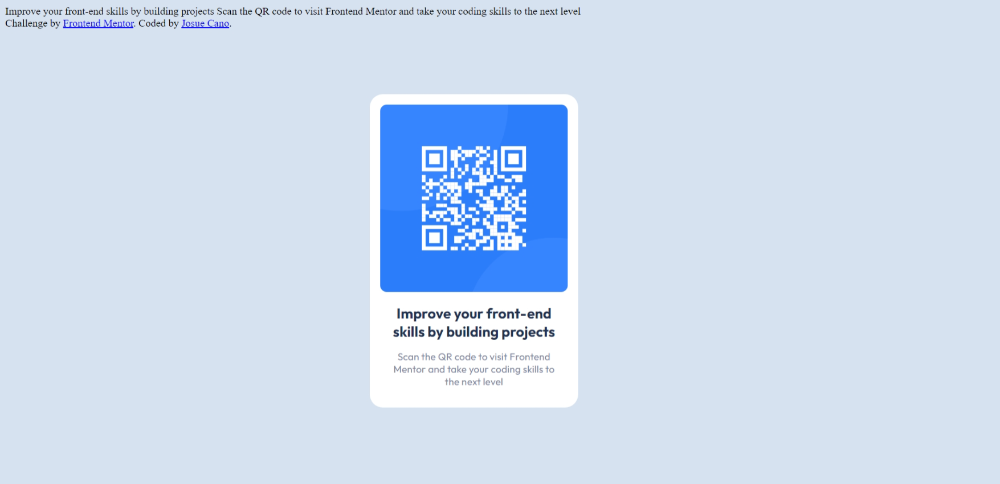

# Frontend Mentor - QR code component solution

This is a solution to the [QR code component challenge on Frontend Mentor](https://www.frontendmentor.io/challenges/qr-code-component-iux_sIO_H). Frontend Mentor challenges help you improve your coding skills by building realistic projects. 

## Table of contents

- [Overview](#overview)
  - [Screenshot](#screenshot)
  - [Links](#links)
- [My process](#my-process)
  - [Built with](#built-with)
- [Author](#author)

## Overview

### Screenshot

### Links

- Solution URL: [Repo](https://github.com/Omiced/qr_code_component)
- Live Site URL: [Web](https://omiced.github.io/qr_code_component/)

## My process

### Built with

- Semantic HTML5 markup
- CSS custom properties
- Flexbox

## Author

- Website - [Josue Cano](https://www.your-site.com)
- Frontend Mentor - [@Omiced](https://www.frontendmentor.io/profile/yourusername)
- Twitter - [@josuecanov](https://www.twitter.com/yourusername)
